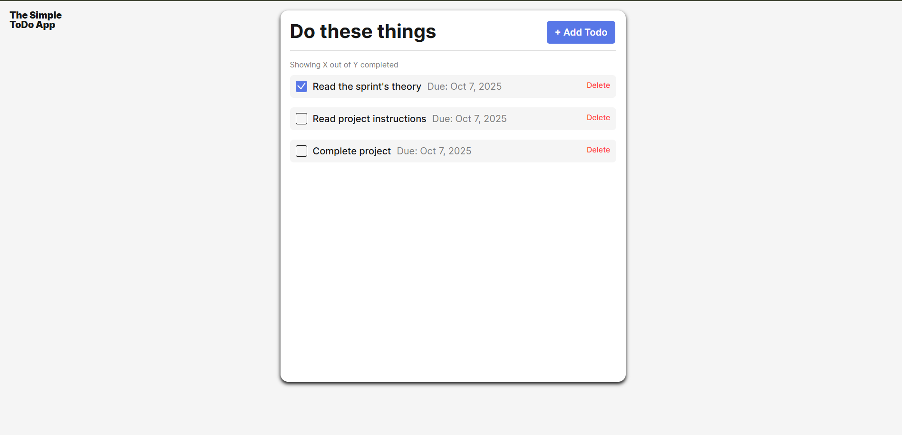
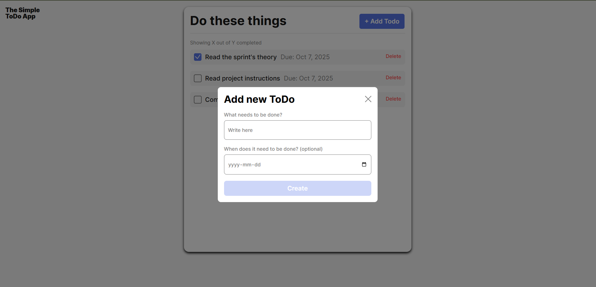
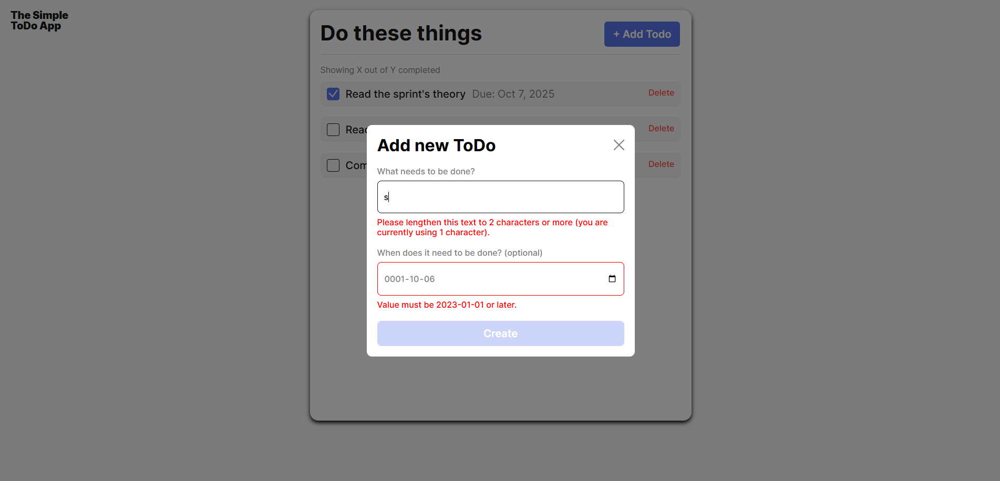
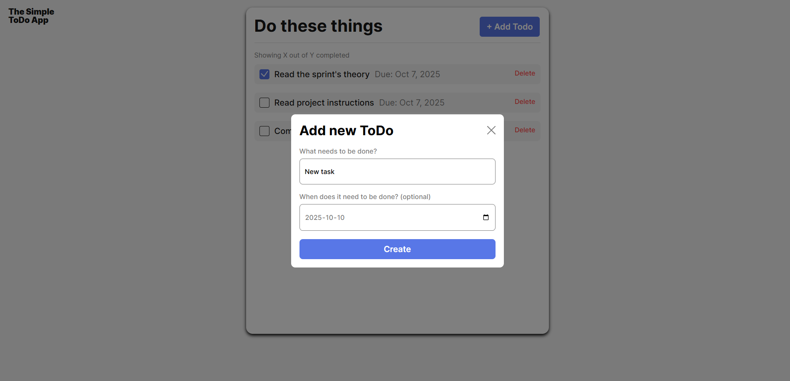
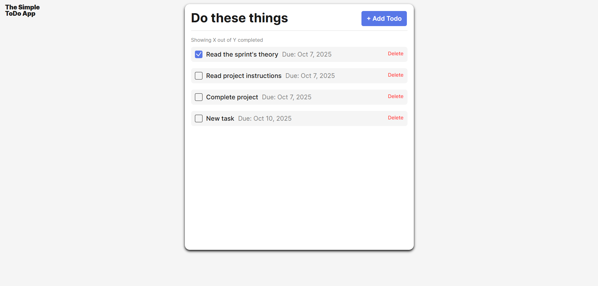

# Simple Todo App

A checklist app that allows users to create and manage tasks. Tasks can be added, removed, and assigned specific deadline dates as needed. Designed for simple and flexible task organization.

## Functionality

Tasks are created using the Add Todo button, where a task name and an optional deadline date can be entered. Each new task is added to the end of the list. When a task is completed, the checkbox on the left can be selected to mark it as done. To remove a task, the delete button next to it can be used.

## Technology

For this project, I mainly worked with JavaScript to improve my OPP skills.

- On the manin page you can see the "Add Todo" button and your existing tasks with their checkboxes and delete buttons.
  

- When you click on the "Add Todo" button, a popup window opens.
  

- If you enter wrong data into the inputs, an error message will appear highlighting the error.
  

- Once you enter valid data, the "Create" button's appearance will change so the user can click it.
  

- The valid task will appear at the end of the list with its respective checkbox and delete button.
  

## Deployment

This project is deployed on GitHub Pages:

- [https://sofia-villazon.github.io/se_project_todo-app/]
